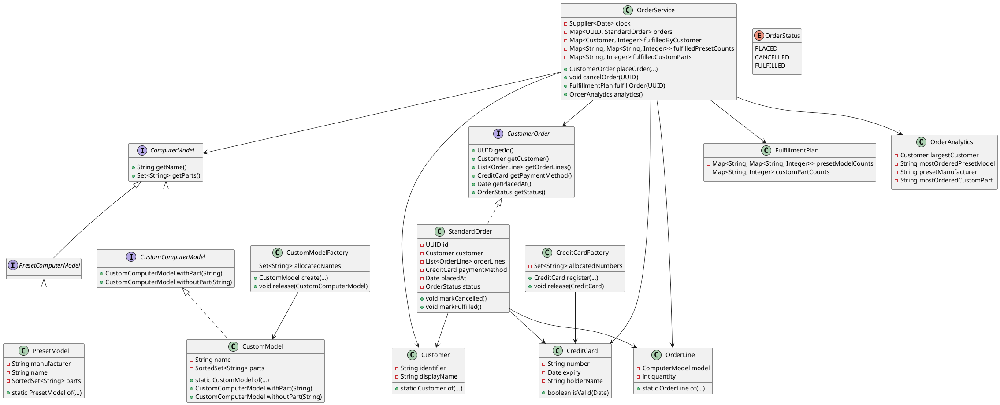

# PC Retailer Order System – Design Notes

# Overview
The system is a model of a retailer who sells preset and custom PCs, handles credit card backed orders, and conducts fulfilment analytics. OrderService is the main component and coordinates the process of making orders, cancelling the orders, fulfilling the orders and reporting and maintaining the domain objects as immutable.

## Key Design Points
Computer Models - Computer models have an interface hierarchy (ComputerModel -PresetComputerModel / CustomComputerModel) to allow late binding of mixed orders.
- Domain objects (`PresetModel`, `CustomModel`, `Customer`, `CreditCard`, `OrderLine, StandardOrder) are all immutable; the factory classes are unique (`CustomModel Factory, Credit Card Factory).
- `OrderService` maintains internal changeable state of lifecycle transitions, but provides orders as a read-only CustomerOrder interface.
- Fulfilment generates a FulfillmentPlan which sums manufacturer and custom part count; analytics are done on-a-fly to eliminate the need to re-process order history.
  JUnit 5 tests are all validation, immutability, lifecycle rules, and analytics edge cases (such as alphabetical tie-breakers).

## UML Class Diagram

